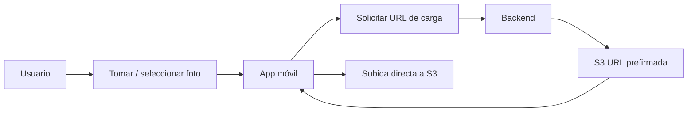
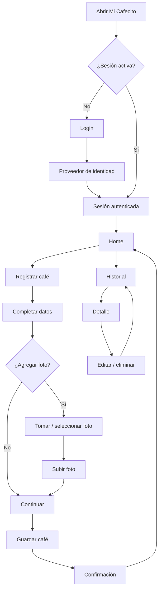
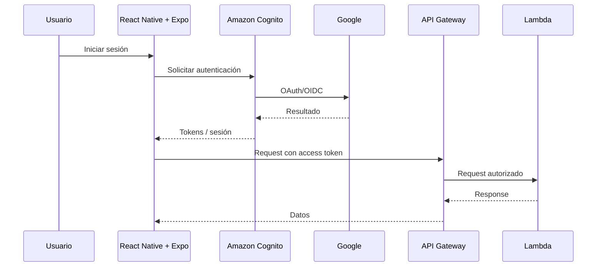
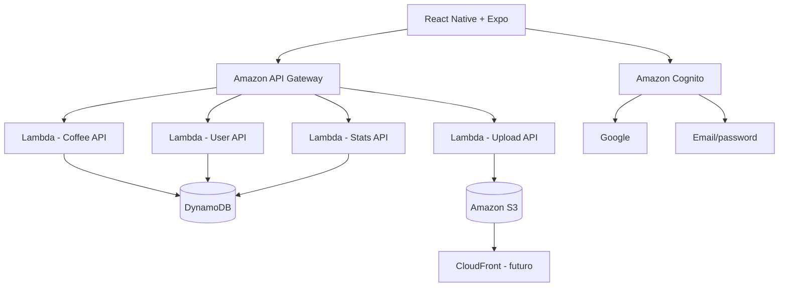

# Mi Cafecito — Documentación de la Fase 1

**Versión:** 1.0  
**Estado:** Planificada  
**Alcance:** MVP personal con arquitectura preparada para evolución multiusuario  
**Fecha:** 2026-08-24

## 1. Descripción general del proyecto

### 1.1 Visión

**Mi Cafecito** es una aplicación móvil orientada a ayudar a cada persona a descubrir qué cafés disfruta realmente a partir de sus propias experiencias.

> **No existe el mejor café para todo el mundo; existe el café que más te gusta a ti.**

La aplicación evolucionará posteriormente hacia características como perfil de preferencias, recomendaciones, descubrimiento de nuevos cafés, eventos y opciones de compra. La primera fase se concentra en construir una base sólida y usable para registrar experiencias reales de consumo.

### 1.2 Objetivo de la Fase 1

Construir el primer vertical slice funcional:

- Aplicación móvil Android/iOS.
- Autenticación con proveedores de identidad.
- Backend serverless.
- Persistencia centralizada.
- Registro de cafés consumidos.
- Fotografías.
- Calificaciones.
- Historial y consulta.
- Estadísticas personales básicas.

Aunque inicialmente sea de uso personal, la arquitectura será **multiusuario desde el comienzo**.

### 1.3 Fuera de alcance

No se implementarán todavía:

- recomendaciones personalizadas;
- IA;
- perfil "ADN Cafetero";
- reconocimiento automático de etiquetas;
- búsqueda global de cafés;
- eventos;
- marketplace;
- integración con tiendas;
- funciones sociales;
- notificaciones;
- monetización.

---

# 2. Requerimientos de negocio

## BR-01 — Registro rápido

Registrar una experiencia debería tomar aproximadamente **30–60 segundos**.

## BR-02 — Sin conocimiento especializado obligatorio

El usuario no necesita conocer procesos, variedades, altitud, TDS, ratio o extracción.

## BR-03 — Datos incompletos permitidos

Debe ser posible registrar únicamente:

- nombre;
- calificación;
- fecha;
- fotografía opcional.

## BR-04 — Gusto personal

La calificación representa principalmente **cuánto disfrutó el usuario el café**, no una evaluación profesional.

## BR-05 — Aislamiento de datos

Un usuario nunca debe poder leer, modificar o eliminar registros de otro usuario.

## BR-06 — Historial útil

El usuario debe poder identificar:

- qué cafés ha probado;
- cuáles le gustaron más;
- favoritos;
- métodos utilizados;
- cafés recientes.

## BR-07 — Evolución

La arquitectura debe permitir posteriormente:

- múltiples usuarios;
- recomendaciones;
- análisis del perfil;
- almacenamiento de imágenes;
- mayor volumen de datos;
- nuevas funcionalidades.

---

# 3. Funcionalidades básicas

## 3.1 Autenticación

Proveedores previstos:

- Google
- Apple
- Microsoft
- Email/password

La autenticación se centralizará con **Amazon Cognito** y federación OAuth/OIDC donde corresponda.

Requisitos:

- login;
- logout;
- renovación de sesión;
- almacenamiento seguro de tokens;
- protección de endpoints;
- asociación automática del usuario autenticado con sus datos.

## 3.2 Registro de café

### Datos mínimos

- nombre;
- calificación;
- fecha de consumo.

### Datos opcionales

- marca;
- origen;
- tostión;
- método de preparación;
- notas;
- fotografía;
- favorito.

## 3.3 Calificación

Escala inicial: **1 a 5 estrellas**.

Orientación:

- 1 — No me gustó.
- 2 — No volvería a elegirlo.
- 3 — Me gustó.
- 4 — Me gustó mucho.
- 5 — De mis favoritos.

No se utilizará inicialmente una escala de 100 puntos.

## 3.4 Fotografías

La imagen se almacena en **S3** y la base de datos guarda solamente su referencia.

Flujo:



## 3.5 Historial

Debe permitir:

- listar;
- ordenar por fecha;
- ver detalle;
- editar;
- eliminar;
- filtrar favoritos;
- visualizar fotografía.

Orden predeterminado: **más reciente primero**.

## 3.6 Detalle

Mostrar toda la información registrada, incluyendo fotografía, calificación, notas y metadatos conocidos.

## 3.7 Edición y eliminación

El usuario puede modificar cualquier dato editable, reemplazar/eliminar fotografía, cambiar calificación, marcar/desmarcar favorito y eliminar el registro.

## 3.8 Estadísticas básicas

- total de cafés;
- calificación promedio;
- cantidad de favoritos;
- mejor café;
- método más utilizado;
- distribución de ratings.

No se requiere todavía un sistema complejo de agregados materializados.

---

# 4. Flujo de usuario



## Flujo de autenticación



---

# 5. Stack tecnológico

| Capa              | Tecnología                  | Propósito                    |
| ----------------- | --------------------------- | ---------------------------- |
| Mobile            | React Native + Expo         | Aplicación Android/iOS       |
| Lenguaje          | TypeScript                  | Código principal             |
| Routing           | Expo Router                 | Navegación                   |
| Data fetching     | TanStack Query              | Estado remoto/cache          |
| Estado local      | Zustand, solo si hace falta | Estado cliente               |
| Forms             | React Hook Form + Zod       | Formularios y validación     |
| Auth              | Amazon Cognito              | Identidad y federación       |
| API               | Amazon API Gateway          | API HTTP                     |
| Compute           | AWS Lambda                  | Backend serverless           |
| Backend           | Node.js + TypeScript        | Lógica de negocio            |
| Framework backend | Ninguno / handlers ligeros  | Reducir complejidad          |
| IaC               | AWS SAM                     | Infraestructura reproducible |
| DB                | DynamoDB                    | Persistencia                 |
| Storage           | S3                          | Fotografías                  |
| CDN               | CloudFront, posteriormente  | Distribución de imágenes     |
| CI/CD             | GitHub Actions              | Automatización               |
| Logs              | CloudWatch                  | Observabilidad               |

## 5.1 Arquitectura general



### Infraestructura como código

AWS SAM debe definir:

- Lambda;
- API Gateway;
- DynamoDB;
- S3;
- IAM;
- variables/configuración;
- outputs;
- recursos relacionados con Cognito según el diseño final.

La infraestructura no debe depender de cambios manuales permanentes realizados desde la consola de AWS.

---

# 6. API inicial

Endpoints conceptuales:

```text
GET    /me

GET    /coffees
POST   /coffees

GET    /coffees/{coffeeId}
PATCH  /coffees/{coffeeId}
DELETE /coffees/{coffeeId}

POST   /coffees/{coffeeId}/photos
DELETE /coffees/{coffeeId}/photos/{photoId}

GET    /stats
```

Las operaciones privadas deben derivar el usuario desde los claims del token autenticado, nunca desde un `userId` enviado arbitrariamente por el cliente.

---

# 7. Estructura de datos

## 7.1 Usuario

```text
User
├── id
├── email
├── displayName
├── avatarUrl
├── createdAt
└── updatedAt
```

El identificador debe derivarse del `sub` de Cognito.

## 7.2 CoffeeEntry

```text
CoffeeEntry
├── id
├── userId
├── name
├── brand?
├── origin?
├── roastLevel?
├── brewMethod?
├── rating
├── notes?
├── photoKeys?
├── isFavorite
├── consumedAt
├── createdAt
└── updatedAt
```

### `roastLevel`

```text
light
medium
dark
```

### `brewMethod`

```text
espresso
v60
chemex
aeropress
french_press
moka
cold_brew
other
```

## 7.3 DynamoDB

Primera estrategia: single-table sencilla.

```text
PK = USER#{userId}
SK = COFFEE#{createdAt}#{coffeeId}
```

Ejemplo:

```text
PK = USER#abc123
SK = COFFEE#2026-08-24T22:00:00Z#01J...
```

Esto permite listar los cafés de un usuario y mantener un orden cronológico.

No se crearán GSIs sin un patrón de acceso real que los justifique.

## 7.4 Fotografías

La BD almacena referencias, con un máximo inicial de tres fotografías por registro:

```text
photoKeys[] =
users/{userId}/coffees/{coffeeId}/{uuid}.jpg
```

No se almacenan binarios en DynamoDB.

Política inicial:

- JPEG y PNG;
- máximo de 10 MB por archivo antes de procesarlo;
- redimensionamiento y compresión en el dispositivo cuando sea conveniente;
- bucket S3 privado y subida directa mediante URL prefirmada;
- eliminación inmediata del objeto antiguo al reemplazar o eliminar una fotografía;
- thumbnails y soporte HEIC quedan para una fase posterior.

---

# 8. Anotaciones técnicas importantes

## 8.1 Seguridad

- Cognito debe centralizar la autenticación.
- No implementar OAuth propio.
- Validar el token antes de ejecutar lógica de negocio.
- Obtener `userId` desde el contexto autenticado.
- Verificar propiedad del recurso en cada operación.
- Bucket S3 privado.
- No usar ACLs públicas.
- Usar URLs prefirmadas de corta duración.
- Validar tamaño y tipo de archivo.
- Aplicar IAM de mínimo privilegio.
- No almacenar secretos en Git.
- Separar configuración por ambiente.
- Evitar logs con tokens, credenciales o información sensible.

## 8.2 Escalabilidad

- APIs paginadas desde el inicio.
- Evitar `Scan` de DynamoDB en operaciones normales.
- Diseñar primero los patrones de acceso.
- Subida directa de imágenes a S3.
- No pasar imágenes grandes por Lambda.
- No crear índices DynamoDB innecesarios.
- Preferir servicios administrados y stateless.

Ejemplo de paginación:

```json
{
  "items": [],
  "nextToken": null
}
```

## 8.3 Disponibilidad

La arquitectura serverless propuesta elimina la necesidad de mantener servidores permanentes.

Para Fase 1:

- una región AWS;
- DynamoDB;
- S3;
- Lambda;
- API Gateway.

No se requiere multi-región todavía.

## 8.4 Backend

Mantener una separación razonable entre:

```text
HTTP / Handler
      ↓
Use Case
      ↓
Domain / Validation
      ↓
Infrastructure
```

No introducir un framework pesado solamente para conseguir organización.

## 8.5 Mobile

- Guardar tokens/sesión en almacenamiento seguro.
- Usar TanStack Query para estado remoto.
- Evitar almacenar secretos en AsyncStorage.
- Manejar estados offline/error de forma clara.
- Comprimir/redimensionar imágenes antes de subirlas si resulta conveniente.
- Diseñar la UI para que los campos opcionales no bloqueen el registro.

## 8.6 Testing

Priorizar:

```text
login
→ registrar café
→ guardar
→ listar
→ detalle
→ editar
→ eliminar
```

Backend:

- unit tests;
- validación;
- autorización;
- casos de uso;
- repositorios;
- integración con servicios AWS donde sea práctico.

Mobile:

- formularios;
- navegación crítica;
- loading;
- errores;
- registro de café.

No perseguir una cobertura numérica arbitraria.

## 8.7 Observabilidad

- CloudWatch Logs.
- Logs estructurados.
- Request/correlation IDs.
- Métricas de errores.
- Alertas mínimas.
- GitHub Actions para CI.

---

# 9. Estructura sugerida de repositorios

## my-coffee-app

```text
my-coffee-app/
├── app/
├── src/
│   ├── components/
│   ├── features/
│   │   ├── auth/
│   │   ├── coffees/
│   │   ├── stats/
│   │   └── profile/
│   ├── services/
│   ├── api/
│   ├── hooks/
│   ├── store/
│   ├── schemas/
│   ├── types/
│   └── utils/
├── assets/
├── tests/
├── app.json
├── package.json
└── tsconfig.json
```

## my-coffee-backend

```text
my-coffee-backend/
├── src/
│   ├── functions/
│   │   ├── getCoffees/
│   │   ├── createCoffee/
│   │   ├── getCoffee/
│   │   ├── updateCoffee/
│   │   ├── deleteCoffee/
│   │   ├── createUploadUrl/
│   │   └── getStats/
│   ├── domain/
│   ├── application/
│   ├── infrastructure/
│   │   ├── dynamodb/
│   │   └── s3/
│   └── shared/
├── tests/
├── template.yaml
├── samconfig.toml
├── package.json
└── tsconfig.json
```

---

# 10. Ambientes y CI/CD

Inicialmente:

```text
local
dev
```

Evolución:

```text
local
dev
staging
prod
```

Configuración por ambiente mediante parámetros/variables de SAM.

Ejemplos:

```text
AWS_REGION
TABLE_NAME
BUCKET_NAME
COGNITO_USER_POOL_ID
COGNITO_CLIENT_ID
API_BASE_URL
```

GitHub Actions debería validar como mínimo:

1. instalación;
2. lint;
3. typecheck;
4. tests;
5. build;
6. validación de SAM;
7. despliegue cuando corresponda.

---

# 11. Decisiones de Fase 1

## Autenticación

- Se utilizará una interfaz de autenticación personalizada integrada con Amazon Cognito.
- Los proveedores iniciales serán email/password y Google.
- Apple y Microsoft quedan fuera del primer release.
- Se permitirá vincular proveedores, pero la vinculación automática exigirá un email verificado y no podrá existir conflicto con otra cuenta.
- Si el email ya pertenece a otra cuenta, se requerirá una vinculación explícita después de iniciar sesión; no se fusionarán cuentas solo por coincidencia de email.

## Usuario

- Se podrá modificar el nombre y el avatar en Fase 1.
- Se persistirá una entidad `User` asociada al `sub` de Cognito, con los datos necesarios para el perfil y sus fechas de creación y actualización.

## Cafés

- El nombre, la marca, el origen y las notas serán texto libre.
- `roastLevel` y `brewMethod` utilizarán los enums documentados.
- Se permitirán hasta tres fotografías por café.
- `consumedAt` podrá ser diferente de `createdAt`; por defecto será la fecha actual y podrá editarse.

## Fotos

- El límite será de 10 MB por archivo y se aceptarán JPEG y PNG.
- La app podrá redimensionar y comprimir la imagen antes de la subida.
- No se generarán thumbnails en Fase 1.
- Las fotografías se eliminarán de S3 inmediatamente cuando el usuario las reemplace o elimine.
- El acceso será privado mediante URLs prefirmadas de corta duración.
- HEIC, thumbnails, retención avanzada y CloudFront quedan para una fase posterior.

## Rating

- Se utilizarán calificaciones enteras de 1 a 5 estrellas.
- La calificación podrá cambiarse al editar el registro.
- No se conservará historial de cambios en Fase 1.

## Infraestructura

- DynamoDB utilizará capacidad On-Demand y el diseño single-table documentado.
- CloudFront se incorporará posteriormente, cuando exista una necesidad real de distribución o caché.
- SAM definirá inicialmente un único stack de aplicación.

## Mobile

- Android e iOS estarán contemplados desde el primer release.
- Durante el desarrollo se utilizará Expo Go.
- El uso de builds EAS y la distribución privada o pública quedan pendientes de decidir antes de preparar el release distribuible.

---

# 12. Criterios de finalización

La Fase 1 se considera terminada cuando:

- el usuario puede autenticarse;
- la sesión puede mantenerse de forma segura;
- puede registrar un café;
- puede añadir una fotografía;
- el backend persiste los datos;
- la fotografía se almacena en S3;
- puede listar sus cafés;
- puede abrir el detalle;
- puede editar;
- puede eliminar;
- puede marcar favoritos;
- puede visualizar estadísticas básicas;
- todas las operaciones están aisladas por usuario;
- existen tests para los flujos críticos;
- el despliegue AWS es reproducible mediante SAM;
- el proyecto puede ejecutarse en un ambiente de desarrollo reproducible.

## Validación de producto

Después de varias semanas de uso personal se debe evaluar:

- ¿se registra un café después de tomarlo?
- ¿el proceso tarda menos de un minuto?
- ¿las fotos aportan valor?
- ¿las calificaciones ayudan a recordar preferencias?
- ¿el historial sirve para decidir qué café volver a comprar/preparar?
- ¿qué datos adicionales aparecen repetidamente en las notas?

Estas respuestas deben dirigir la Fase 2.
